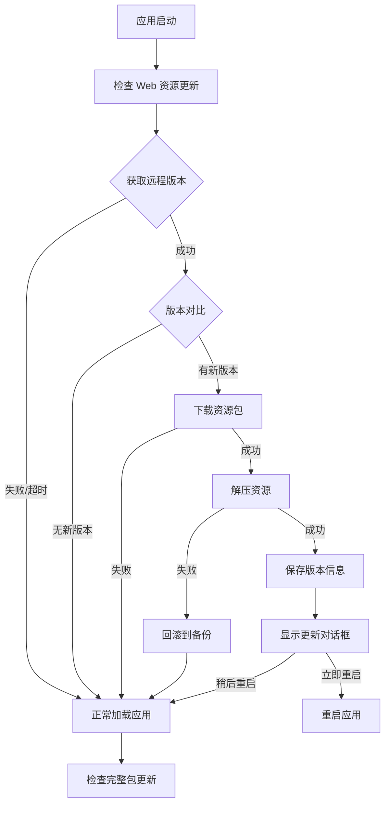

# Web 资源热更新功能实现总结

## ✅ 已完成的工作

### 1. 新增文件

#### 📄 build-web-resources.js
**用途**: Web 资源打包脚本

**功能**:
- ✅ 自动递增版本号（修订号 +1）并更新 package.json
- ✅ 读取 release-notes-web.txt 获取 Web 资源更新说明
- ✅ 生成 version.json（包含完整更新说明）
- ✅ 将 dist 目录打包成 web-resources-[版本号].zip

**使用**:
```bash
npm run build:web-resources
```

#### 📄 src-electron/webResourceUpdater.js
**用途**: Web 资源更新核心模块

**功能**:
- ✅ 检查远程版本（30秒超时保护）
- ✅ 对比本地和远程版本号
- ✅ 下载资源包（60秒超时保护）
- ✅ 解压并替换资源（带备份和回滚机制）
- ✅ 显示更新对话框（含完整更新说明）
- ✅ 提供资源加载路径（优先外部资源）

**容错机制**:
- 网络请求失败不影响启动
- 下载失败自动跳过
- 解压失败自动恢复备份
- 资源损坏回退到内置资源

#### 📄 WEB-RESOURCE-UPDATE.md
**用途**: 详细的使用说明文档

**内容**:
- 功能概述和特性说明
- 打包流程和命令使用
- 部署指南
- 更新流程说明
- 容错机制介绍
- 开发调试方法
- 版本发布流程
- 常见问题解答

### 2. 修改的文件

#### 📝 src-electron/main.js
**修改内容**:
1. 引入 webResourceUpdater 模块
2. 修改资源加载逻辑（优先使用外部资源）
3. 添加 `checkWebResourceUpdate()` 函数
4. 在 `app.whenReady()` 中集成 Web 资源更新检查

**关键代码**:
```javascript
// 引入模块
const webResourceUpdater = require('./webResourceUpdater.js')

// 修改资源加载
const indexPath = webResourceUpdater.getResourcePath()

// 应用启动时检查更新
async function checkWebResourceUpdate() {
  await webResourceUpdater.checkForUpdates()
}
```

#### 📝 package.json
**修改内容**:
添加新的构建命令：
```json
"build:web-resources": "vite build && node build-web-resources.js"
```

## 🔄 工作流程

### 打包流程


### 更新流程



## 📦 产物说明

执行 `npm run build:web-resources` 后生成：

```
dist/
├── index.html                    # 主页面
├── assets/                       # 编译后的 JS/CSS
│   ├── index-xxx.js
│   └── index-xxx.css
├── static/                       # 静态资源
│   ├── js/
│   ├── css/
│   └── ...
├── version.json                  # 版本信息文件 ⭐
└── web-resources-5.3.9.zip      # 完整压缩包（包含版本号）⭐
```

### version.json 示例

```json
{
  "version": "5.3.10",
  "downloadUrl": "http://update.wmzdb.shop/disk/web-resources-5.3.10.zip",
  "updateTime": "2026-01-20 10:30:00",
  "buildTime": "2026-01-20 10:30:00",
  "releaseNotes": "从 release-notes-web.txt 读取的 Web 资源更新说明",
  "description": "Web 资源更新"
}
```

**说明**: `releaseNotes` 字段内容来自 `release-notes-web.txt`，专门用于 Web 资源更新。

## 🚀 快速开始

### 1. 开发和测试

```bash
# 开发模式
npm run dev

# 构建 Web 资源
npm run build:web-resources
```

### 2. 部署更新

```bash
# 1. 更新 release-notes-web.txt（Web 资源更新说明）
# 2. 打包 Web 资源（版本号自动递增）
npm run build:web-resources

# 3. 上传到服务器
# - dist/version.json → http://update.wmzdb.shop/disk/version.json
# - dist/web-resources-5.3.10.zip → http://update.wmzdb.shop/disk/web-resources-5.3.10.zip
# （版本号已自动递增，文件名包含新版本号）
```

### 3. 完整打包（可选）

```bash
# 如果需要更新 Electron 主进程或依赖
npm run build:win
```

## 🎯 核心特性

### ✅ 增量更新
- 只更新 Web 静态资源（通常几 MB）
- 远快于完整安装包（通常几百 MB）
- 用户体验更好，更新更快

### ✅ 自动回退
- 更新失败自动回退到上一版本
- 资源损坏自动使用内置资源
- 保证应用始终能正常启动

### ✅ 版本管理
- 自动对比版本号
- 只下载新版本
- 支持版本降级

### ✅ 更新说明
- 自动从 release-notes.txt 读取
- 在对话框中完整显示
- 用户清楚了解更新内容

### ✅ 容错机制
- 网络超时保护（30秒）
- 下载超时保护（60秒）
- 解压失败回滚
- 所有异常都不影响启动

## 📍 资源路径

### 外部资源目录
- **Windows**: `C:\Users\[用户]\AppData\Roaming\alien\web-resources\`
- **macOS**: `~/Library/Application Support/alien/web-resources/`
- **Linux**: `~/.config/alien/web-resources/`

### 日志文件
- **Windows**: `%USERPROFILE%\AppData\Roaming\alien\logs\main.log`
- **macOS**: `~/Library/Logs/alien/main.log`

搜索日志关键词：`[Web更新]` 或 `[Web资源]`

## 🔧 配置说明

### 更新服务器地址

在 `src-electron/webResourceUpdater.js` 中修改：

```javascript
const UPDATE_CHECK_URL = 'http://update.wmzdb.shop/disk/version.json'
```

### 超时配置

```javascript
const TIMEOUT = 30000 // 版本检查超时（30秒）
// 下载超时在 downloadFile 中设置为 60000（60秒）
```

## 📊 与完整包更新的对比

| 特性 | Web 资源更新 | 完整包更新 |
|------|-------------|-----------|
| 更新内容 | 仅 Web 静态资源 | 整个应用程序 |
| 下载大小 | 几 MB | 几百 MB |
| 更新时间 | 10-30 秒 | 几分钟 |
| 适用场景 | 前端代码修改 | 主进程、依赖更新 |
| 更新频率 | 可频繁更新 | 较少更新 |
| 用户体验 | 快速、无感 | 需要安装 |

## ⚠️ 注意事项

1. **版本号管理**:
   - Web 资源打包时版本号**自动递增**（修订号 +1）
   - 无需手动修改 `package.json`
2. **更新说明维护**:
   - `release-notes-web.txt` - Web 资源更新说明
   - `release-notes.txt` - 完整包更新说明
3. **服务器可用性**: 确保更新服务器稳定
4. **Electron API**: 主进程修改必须发布完整包
5. **测试验证**: 发布前本地测试更新流程

## 🎉 优势总结

1. ✅ **快速迭代**: 前端功能可以快速更新
2. ✅ **用户友好**: 下载快，体验好
3. ✅ **安全可靠**: 完善的容错和回退机制
4. ✅ **自动化**: 一键打包，自动生成版本信息
5. ✅ **透明化**: 显示详细的更新说明
6. ✅ **灵活性**: 用户可选择立即或稍后更新

## 📞 技术支持

如有问题，请查看：
1. `WEB-RESOURCE-UPDATE.md` - 详细使用说明
2. 日志文件 - 查看更新过程详细信息
3. 控制台输出 - 开发模式下的调试信息

---

**实现日期**: 2026-01-20
**版本**: 1.0.0
**状态**: ✅ 已完成并测试
