# 需求说明
此需求为了 实现 `F:\waimaiguang\faster-move-web\src\views\shopCopy\components\ToolList.vue` 中的批量改价 和 图片加边框功能, 现后端接口已编码完成,需要前端实现!

# 后端接口
[swagger url中包含了所有需要对接的接口](http://localhost:5130/swagger/FoodManage/swagger.json)

## 怎样将此模块接入到项目

参考 `src\views\shopCopy\components\MoveShop.vue` 能收接的参数,以及是谁调用了它!

## 如何调用

当进入首页时,应自动createTask 拿到 `taskid`,后续调用其他接口时都需要用到,   参考 `src\views\shopCopy\components\MoveShop.vue` 中的cdreateTask 调用逻辑,但是不用createClient 我们用的是固定的线路!

参考 `src\api\foodMove.ts` 用什么host, 如何添加凭证,添加请求头等 新建 `src\api\foodManage.ts` 将调用api的方法写到这个文件中.

### 流式响应接口
在后端接口中  所有返回值类型为 `ProgressInfo` 的都是流式响应接口,代表此接口会不停的响应进度信息来提示当前接口的执行进度以及日志等信息. 所以当调用的接口是流式响应时,需要弹出一个进度窗显示任务进度以及支持停止的页面! 参考 `src\views\shopCopy\components\MoveShop.vue` 中的进度条显示效果.

# UI交互

以下示例来自同行操作交互截图,某些提示和交互会有变动,如有变动具体会在每项操作项中说明! 每一项操作都是针对选择的店铺或选择的商品或连带商品和sku

# 交互优化
  如果只是单纯的提示文字时,如果选中了商品或sku 就要优化提示比如"确定对xxx个商品进行xxx操作" ,如果没选中商品只选择了某分组, 就要优化提示如"确定xxx分组下所有商品进行xxx操作吗", 如果什么都没选中, 哪就优化提示如"确定对xxx店铺下所有商品进行xxx操作吗"

## 总体效果
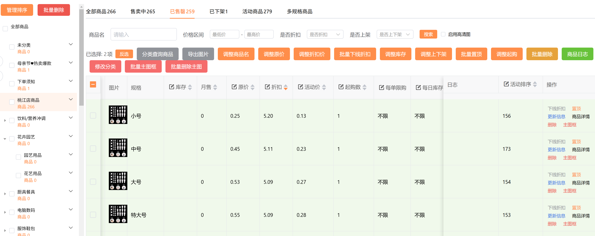
### 左边的是商品分组 ,右边是各功能项操作
分组的显示 参考 `src\views\shopCopy\components\MoveShop.vue`

### 变更部分
"启用高清图" 哪个复选框改成 "实时同步到平台" 用于api调用绑定参数中的 `SyncSite` 字段!

## 商品列表的显示
我截图中的列表显示的是每个商品的sku ,但我们的不一样,我们是每一行显示一个商品,然后商品中还有sku集合, 所以每一行要做展开行来支持sku编辑 ,参考 [展开行](https://element-plus.org/zh-CN/component/table.html)

## 点击交互示例

### 右边商品分组区域
#### 分组复选框复选框被点击或者说被改变
正常只有二级分组, 一级分组点击时子分组应全部选中或取消选中, 二级分组点击时一级分组的全选中状态应改变
#### 分组被点击(非复选框选中)
 此时搜索区域的表单应清空重置后重新加载商品
### 顶部tab 区域点击
即 全部商品,已售罄,已下架,活动商品,多规格商品 通过获取商品列表接口的参数进行过滤重新加载商品,此时搜索区域的表单应清空重置!

### 点击"搜索"
没有弹出提示,重新加载分组商品列表

### 点击“调整商品名”
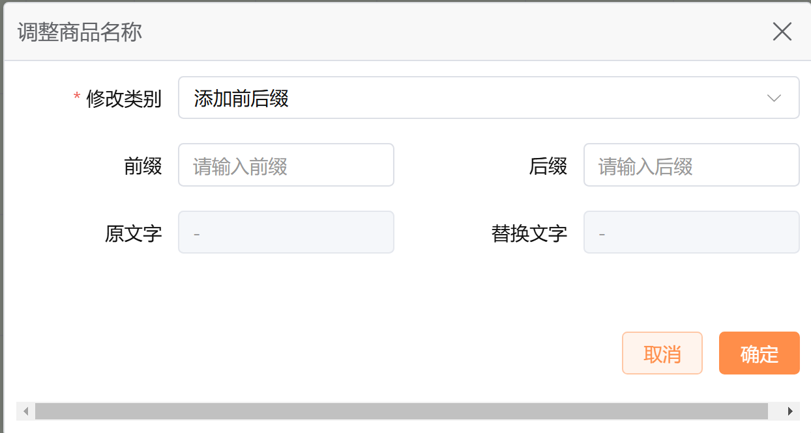
### 点击“调整原价”
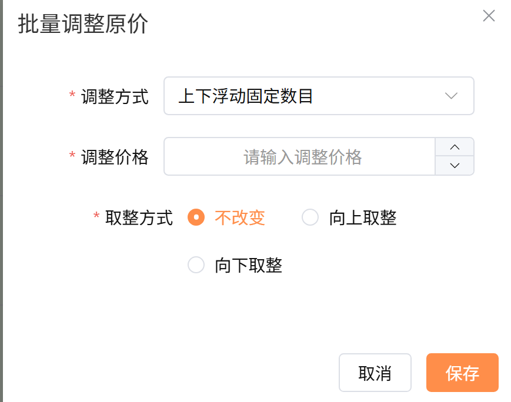
### 点击 “调整折扣价”
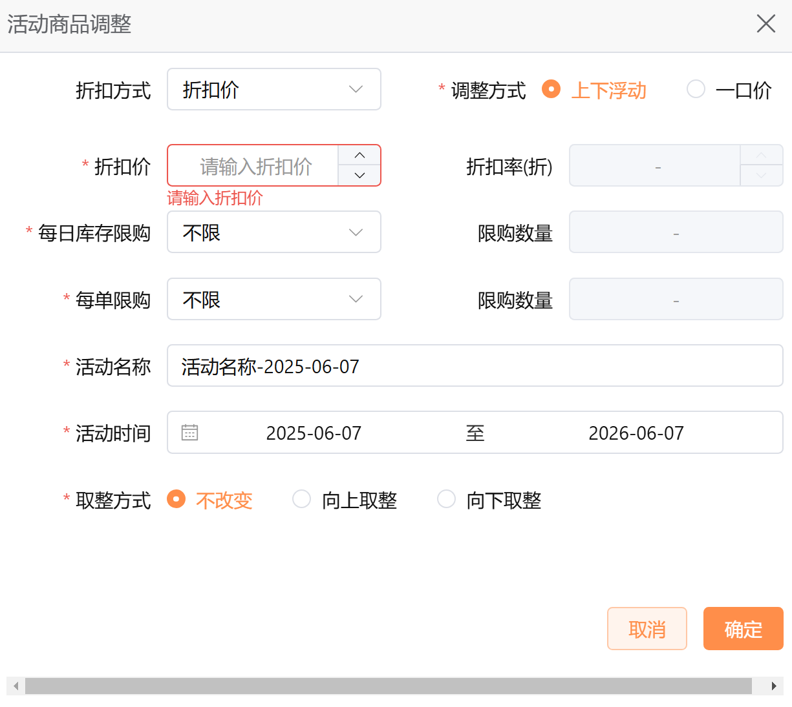
### 点击“批量下线折扣”
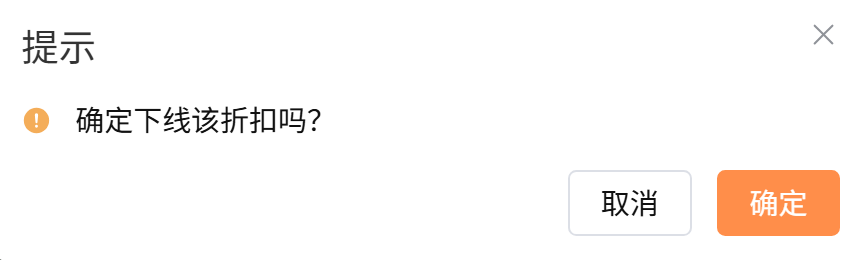
  这里要优化下, 参考 #交互优化
### 点击“调整库存”
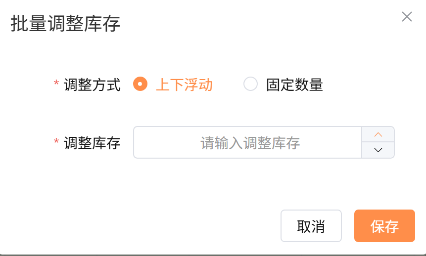
### 点击“调整上下架”
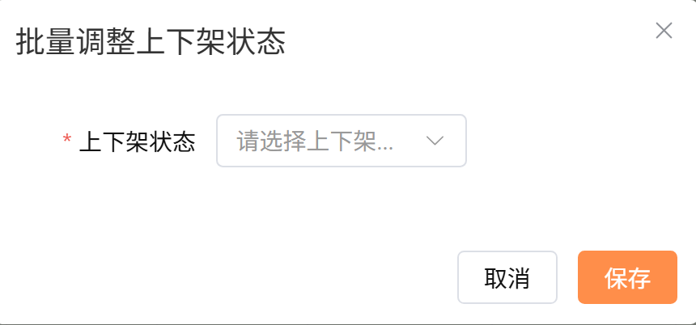
### 点击“设置起购”
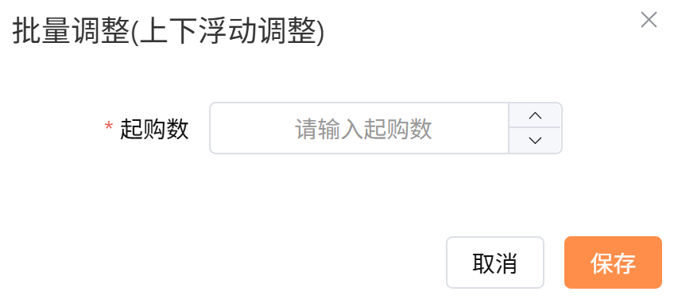
### 点击“批量删除”
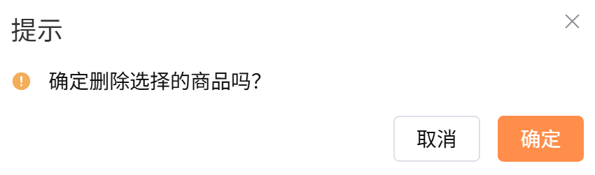
  这里要优化下, 参考 #交互优化

### 点击“批量主图框”
  也就是加商品边框
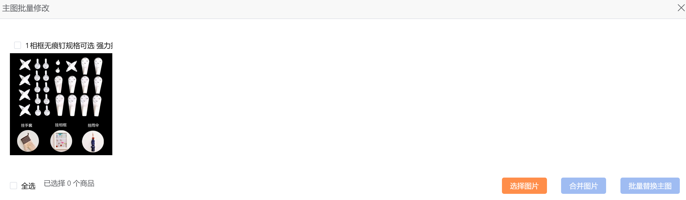
### 点击“批量删除主图”
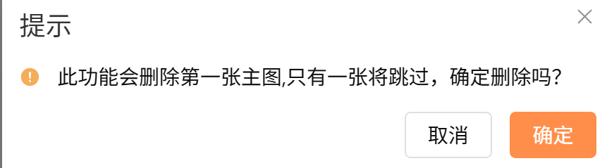
  这里要优化下, 参考 #交互优化

### 商品列表中的交互
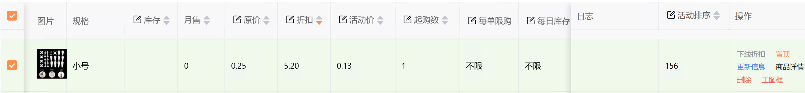
#### 单元格被点击
  如果当前商品中绑定的字段是接口支持更改的就要显示对应的编辑控件,值改变时也要调用相关接口.如下图所示
  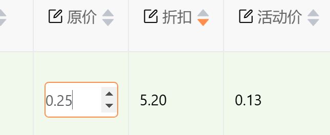

#### "下线折扣" 被点击
参考 #下线折扣被点击 只不过等于是仅选择当前行的商品

#### "删除" 被点击
即删除商品, 也参考 上面的操作按扭,只是仅当前商品而已

#### "主图框" 被点击
也参考 #点击“批量主图框”  只是仅当前商品而已

#### "商品详情" 被点击
此功能的原理是一个elctron 浏览器窗口浏览商品, 你只需要给我随便打开个网址就行.后期我会按我的业务需求改!

我没提到的 "更新信息","置顶" 由于业务调整,目前不用实现!

# 开发要求

### 项目目录
考虑到需求的复杂性, 需要将此需求做为一个模块放在 `src\views\foodManage` 中
在调用接口前请分析swagger.json 中的接口参数和返回类型的数据结构定义, 然后生成TypeScript 类型 在放在模块目录的types 中, 但在生成类型时,要检查结构是否已在 src/types 目录中存在,存在就不要新建了,一定要复用.

#### 组件式开发
根据UI交互适当的封装组件,避免全部在一个文件中

#### UI框架
参考本项目开发的其他模块, ui框架用的是 shop-vite 该ui框架文档需要密码
文档访问地址：https://vuejs-core.cn/shop-vite-book-2025
密码 zxwkcg 回车
该UI框架的组件参考`F:\waimaiguang\faster-move-web\library\build\unplugin\components.d.ts`
此UI框架也是基于 `element-plus` 所以当然你也可以使用 `element-plus`

如果后端接口无法满足当前需求的UI交互, AI应先向我确认或建议操作, 得到我肯定的回复时才继续!